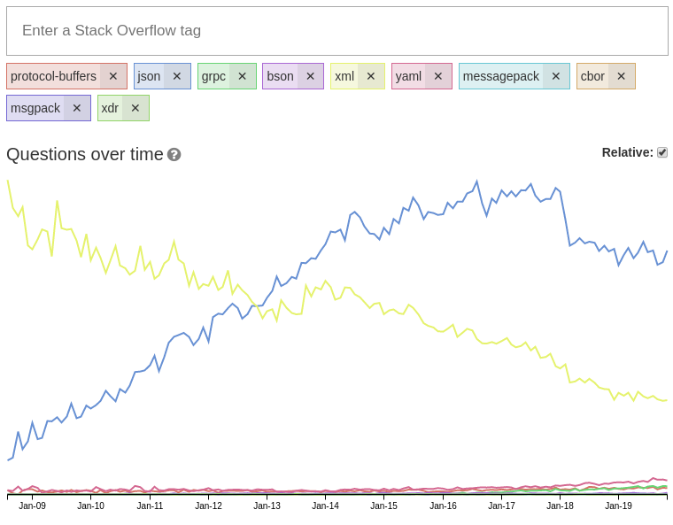

# Let's fix json

JSON is everywhere. A lot of specs got better during the last years (tcp, http, JavaScript), but up to now the fundamental important data interchange format JSON has not changed much.

## Why?

Roughly five years ago, in the year 2014 I thought: JSON is just a temporary solution. Its wide spread usage will decrease like XML. XML is mostly gone today. I thought [Protocol Buffers](https://en.wikipedia.org/wiki/Protocol_Buffers) is the future, since it supports more data types and is faster.

But the StackOveflow TagTrend makes it clear. JSON won't disapear and protobuf won't be widespread soon:

[TagTrend JSON and alternatives](http://sotagtrends.com/?tags=protocol-buffers+json+grpc+bson+xml+yaml+messagepack+cbor+msgpack+xdr):



This means we need to do upgrades in small steps.

## Long term goal: pluggable data types

If the sender and the receiver agree upon some data types, it should be simple to add new data types to JSON.

## Current step: Dream of fancy perfect future

How do we want JSON to be in the future?

Before consensus can be reached, the dream need to be written down.

## Later

??? up to now it is unclear how to update the specs. But I guess we will find a way.

## Feedback needed

Please tell me what you think:

- What do you want to add to JSON?
- Why do you prefer a different a different data format? Why do you think other formats are better?


Let's influence the future **together** :-)

Please create a new issue and tell us how you would like JSON to look like in the future: https://github.com/guettli/lets-fix-json/issues/new

### binary data type

There thousand ways to work around it. Very common is base64 encoding. But that's a useless work-around.

In Python you can create binary data with the "b" prefix. Example:

```
binary_data = b'\x00\xff....'
```

### add datetime

It would be nice to support it.

Other tools which support this:

* [PostgreSQL Date/Time](https://www.postgresql.org/docs/12/datatype-datetime.html#DATATYPE-DATETIME-INPUT)
* [Protobuf Timestamp](https://developers.google.com/protocol-buffers/docs/reference/google.protobuf#google.protobuf.Timestamp)
* [Python datetime](https://docs.python.org/3/library/datetime.html#datetime-objects)
* [JavaScript Temporal](https://github.com/tc39/proposal-temporal)

Soon you can parse datetimes in JavaScript like this: `Temporal.DateTime.from("2019-11-26T14:58:54.147Z")`.

But I want more. I don't want to parse strings and convert them to an object over and over again. I want to parse a JSON string and get nice high level DateTime objects immediately.

### add timedelta

A timedelta datatype would be very nice.

Other tools which support this: 

* [PostgreSQL Interval](https://www.postgresql.org/docs/12/datatype-datetime.html#DATATYPE-INTERVAL-INPUT)
* [Protobuf Duration](https://developers.google.com/protocol-buffers/docs/reference/google.protobuf#duration)
* [Python timedelta](https://docs.python.org/3/library/datetime.html#timedelta-objects)

### add comments

Quoting @asb:

> Leave comments is essential for human beings understand what is going up.
> Is the best practice in any programming language.
> Is kind and nice for all who will study what is done.
> Every one knows that JSON was, -was- a encapsuled internal way to exchange data in javascript
> but now JSON is used do describe the data for all world.
> So, please make // into comments for JSON, let the spice flow.

Why HCL (HashiCorp Configuration Language) was invented:

> JSON ... is fairly verbose and most importantly doesn't support comments. 

Source: https://github.com/hashicorp/hcl

## Alternatives

There are several alternatives to JSON. I think it makes more sense to upgrade JSON, than to use an alternative

- [Protocol Buffers](https://en.wikipedia.org/wiki/Protocol_Buffers) supports above feature, except comments. The major drawback that you are forced to define your data in a IDL (interface definition language). Second draw back: it is binary
- [BSON](https://en.wikipedia.org/wiki/BSON) Draw back: it is binary. It does not support timedelta.

## Related

- [Let's fix JS](https://github.com/guettli/lets-fix-js)
- https://stackoverflow.com/questions/58573784/who-is-responsible-for-updates-to-the-json-spec

## Thanks

- People involved in the early discussion: https://es.discourse.group/t/json-add-datetime-timedelta-and-binary-data-types/134
- Chip Morningstar (current editor of the JSON spec)[His reply to my question](https://es.discourse.group/t/update-json-spec/128/4)
